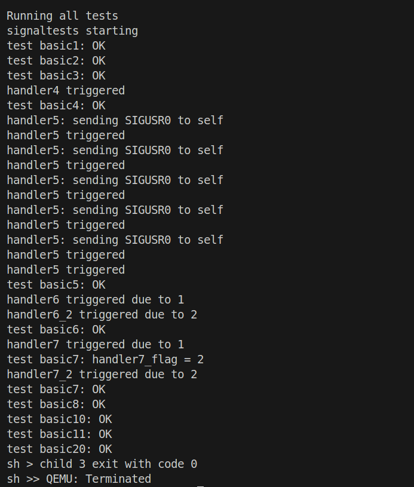
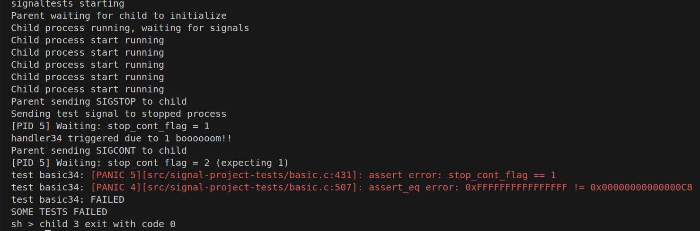
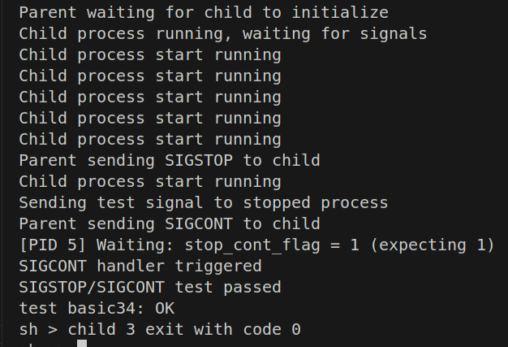

# OS project

## 小组成员

| 学号     | 姓名   | 贡献比 |
| -------- | ------ | ------ |
| 12210653 | 张伟祎 | 50%    |
| 12212012 | 叶航见 | 50%    |

## 项目架构

 一、设计架构总览  

| 模块        | 作用                                                    |
| ----------- | ------------------------------------------------------- |
| sigaction   | 注册信号处理函数、屏蔽掩码与还原函数                    |
| sigkill     | 向指定进程发送信号                                      |
| sigreturn   | 信号处理函数返回后恢复上下文                            |
| sigpending  | 查询当前进程 pending 状态的信号集                       |
| sigprocmask | 设置/查询当前进程的信号屏蔽集                           |
| do_signal   | 在从内核返回用户态前检查 pending 信号，触发信号处理逻辑 |
| context     | 使用 ucontext_t 结构保存/恢复信号前后上下文             |

二、数据结构设计

1. sigaction_t（每个信号一个）

2. signal_state（进程控制块中）

三、Signal 生命周期

- 信号产生（sigkill）
  sigkill(pid, signo, code) 设置目标进程的 sigpending。

- 信号交付（do_signal）
  - 每次从内核返回用户态（usertrap()）前调用 do_signal()：
  - 遍历 pending 信号，按优先级处理；
  - 若信号未被屏蔽，执行：
    - 默认行为 SIG_DFL：使用 setkilled(p, -10 - signo) 杀死进程；
    - 忽略行为 SIG_IGN：直接清除 pending；
    - 自定义 handler：
      - 保存当前上下文 save_context()；
      - 构造用户栈：写入 siginfo_t；写入 ucontext；
      - 设置 a0-a2 传参；
      - 设置 epc = handler，ra = sa_restorer (sigreturn)；
      - 更新进程的 sigmask（阻塞当前信号和 sa_mask 中的信号）。
- 信号返回（sigreturn）
  - 调用 sys_sigreturn()；
  - 从栈中读取 ucontext，恢复 trapframe 与 sigmask；
  - 继续执行被中断的代码。

## 实现细节

### basic 1 默认处理行为SIG_DFL

✅ 向子进程发送 SIGUSR0，应被默认终止（exit(-10 - SIGUSR0)）

### basic 2 SIG_IGN

✅ 设置 SIGUSR0 为 SIG_IGN，信号应被忽略，进程继续正常退出

❗遇到报错：[PANIC 0,7] os/vm.c:62: assertion failed: holding(&mm->lock)

解决方法：需要在涉及用户内存访问的所有地方加锁 `p->mm->lock`

```
acquire(&p->mm->lock);
// 访问用户内存
release(&p->mm->lock);
```

### basic 3 自定义信号处理程序退出流程

✅ 子进程注册 SIGUSR0 的自定义handler，并在handler中直接 exit，不返回

❗遇到报错：  
[ERROR 0,9] kernel_trap: =========== Kernel Panic ===========
sstatus : 0x8000000200006100  
SUM:0, SPP:S, SPIE:0, SIE: 0  
scause  : 0x000000000000000f  
Interrupt:0, Code:15  
sepc    : 0xffffffff8020ac74  
stval   : 0x00000000fffefdb0  
sip     : 0x0000000000000000  
Pending: Software:0, Timer:0, External:0
sie     : 0x0000000000000220  
Enabled: Software:0, Timer:1, External:1
satp    : 0x8000000000080400  
kernel trapframe at 0xfffffffe00011e30  
ra: 0x00000000fffefea0   sp: 0xfffffffe00011e30   gp: 0x0000000000000000  tp: 0x0000000000000000  
t0: 0x0000000000000000   t1: 0x00000000004021bc   t2: 0x0000000000000000  s0: 0xfffffffe00011fc0  
s1: 0x0000000000000001   a0: 0x0000000000000000   a1: 0x000000000000000d  a2: 0x0000000000000020  

在 `do_signal` 函数里：

```
uint64 new_sp = p->trapframe->sp - sizeof(struct ucontext) - sizeof(siginfo_t);
struct ucontext *uc = (struct ucontext *)(new_sp + sizeof(siginfo_t));
save_context(p, uc);
```

问题原因：`uc` 指向的是用户栈中的一块地址，但传进去 `save_context(p, uc)` —— 这是一个纯内核函数，它直接写入 `uc->uc_mcontext.regs[...]`，而 `uc` 是一个用户空间地址！因此会造成非法写访问

解决方法：创建一个内核临时 `ucontext` 结构体变量；使用 `copy_to_user()` 将它写入用户栈。

### basic 4 自定义handler + sigreturn

✅ 子进程注册handler，handler执行后正常返回并退出，验证 sigreturn() 能正常恢复状态

❗遇到报错：assert_eq error: 0xFFFFFFFFFFFFFFFE != 0x0000000000000068

问题原因：`sa_restorer` 是 **用户空间代码**，负责 `ecall` 回到内核执行 `sigreturn`；设置内核函数地址是非法行为，用户程序无法直接 `ret` 到内核。  
解决办法：  
  原来：p->trapframe->ra = (uint64)sys_sigreturn;  
  改为：p->trapframe->ra = (uint64)p->signal.sa[i].sa_restorer;

### basic 5 信号阻塞+递归调用

✅ handler5中再次触发SIGUSR0，验证内核在handler运行期间阻塞相同信号（共执行5次）

❗遇到问题：循环执行一次后卡住

问题1： p->signal.sigpending &= ~(1ULL << i); 把解除pending的语句移到最前面。 （不知道为什么生效）

问题2：p->signal.sigmask |= (1ULL << (i-1))  改为 p->signal.sigmask |= (1ULL << (i))  

### basic 6 嵌套handler

✅ 子进程处理中SIGUSR0时接收SIGUSR1，验证信号可以嵌套处理（handler6 -> handler6_2）

### basic 7 信号屏蔽与延迟递送

✅ handler7 在处理 SIGUSR0 时屏蔽 SIGUSR1，待恢复后再触发 SIGUSR1 对应的 handler7_2

❗遇到报错：[PANIC 17][src/signal-project-tests/basic.c:223]: assert error: handler7_flag == 2  
问题原因：调试时让代码打印处理handler7_2 方法时 handler_flag 的值为1，说明在处理handler7_1 方法时并未屏蔽 handler7_2， 原因出在p->signal.sigmask |= (1ULL << (i))  
解决方法：改成 p->signal.sigmask |= (1ULL << (i)) | p->signal.sa[i].sa_mask; 即可正确屏蔽

### basic8 SIG_IGN后SIG_DFL恢复

✅ 先忽略 SIGUSR0，后恢复 SIGUSR1 的默认行为，应由 SIGUSR1 终止进程

### basic 10 SIGKILL不可捕获

✅ 注册handler处理SIGKILL，但系统应忽略注册，仍直接杀死子进程

### basic 11 SIGKILL不可屏蔽

✅ 用sigprocmask屏蔽SIGKILL，应仍可杀死子进程

### basic 20 信号行为继承与隔离

✅ 父进程忽略 SIGUSR0，fork 出来的子进程也忽略，验证 handler 不被传染给父进程

> **运行截图**
>
> 

### Optional basic 31 定时发送 SIGALRM

#### Testcase 设计

- 基本定时功能测试  
  - 验证在指定时间（3秒）后进程是否收到 SIGALRM 并调用信号处理函数 handler31
  - alarm_flag == 1，说明 handler 被调用
- 取消alarm并获取剩余时间  
  - 测试重设 alarm 并调用 alarm(0) 能否取消并返回剩余时间
  - 重新设定返回值应为 0
  - alarm(0) 返回值必须在合理范围内（>=2 且 <=5）
- 信号不应触发
  - 在取消 alarm 后，确保不会再触发 SIGALRM
  - alarm_flag 仍为 0

#### 代码实现

用户态：  
 alarm(t)           → trap into sys_alarm()
                    → 设置 alarmticks

每 tick 中断：  
 trap → handle_intr()
 if 到期 → sys_sigkill(SIGALRM)

返回用户态前：  
 do_signal()       → 构造用户栈 + 跳转 handler31

 handler31()      → 用户态执行逻辑
 sigreturn()      → 回到 alarm 后续代码

#### debug

❗遇到报错：  
test basic31: [PANIC 27][src/signal-project-tests/basic.c:398]: assert_eq error: 0x0000000000000000 != 0x0000000000000001
test basic31: [PANIC 26][src/signal-project-tests/basic.c:419]: assert_eq error: 0xFFFFFFFFFFFFFFFF != 0x00000000000000CA

✅
ticks kernel全局变量 内核中记录的"时钟中断次数"，即系统启动后经过的“时间片”数量
alarm(seconds)用户态系统调用 单位是秒
sleep(n) 用户态调用 单位是tick 1 tick = 10ms 或根据时钟频率设定

> **运行截图**
>
> 

### Optional basic 34 SIGSTOP和SIGCONT处理

#### 做法

1. 在**do_signal（）**里面增加对sigcont和sigstop信号的处理逻辑c

   ```c
    // 处理 SIGCONT 信号
       if (p->signal.sigpending & (1ULL << SIGCONT)) {
           // 如果进程当前被停止，则恢复它
           if (p->stopped) {
               p->stopped = 0;
           }     
       }
       //若进程stopped，则直接返回
       if (p->stopped || !p->signal.sigpending) {
           return 0;
       }
   ```

2. 在**scheduler**() 方法里面增加对flag stop为1的进程进行屏蔽

      ```c
      if (p->state == RUNNABLE && !p->stopped) {
                  add_task(p);
              }
      ```

#### 样例设计

流程： 父进程fork子进程--》 子进程开始跑 --》父进程给子进程发SIGSTOP --》 父进程给子进程发SIGUSR0（正确的话应该不执行）--》 父进程给子进程发SIGCONT -》子进程执行SIGCONT 注册的handler_cont函数 -》退出

开始时 若不对SIGSTOP和SIGCONT 处理，子进程会运行SIGUSR0注册的handeler34函数，因此会报错：



正确处理SIGSTOP和SIGCONT 逻辑后，运行结果为：



## 上板

❗上板进入sh无法输入

```c
for (int i = 0; i < NPROC; ++i) {
    struct proc *p = pool[i];
    ...
    if (p->alarmticks > 0 && ticks >= p->alarmticks) {
        p->alarmticks = 0;
        sys_sigkill(pid, SIGALRM, 0);
    }
}
```

无差别地对所有进程检测alarm，到时后就送 SIGALRM，但sh没注册 SIGALRM handler，SIGALRM 的默认行为是 terminate 导致sh被误杀了
但是 为什么 qemu里正常？
在 qemu中，timer、ticks、trap 都是模拟出来的，ticks 非常缓慢。而板子上的 CLINT 是真实硬件触发的时钟中断，tick 速度快很多。
因此在qemu中，你没来得及触发SIGALRM，shell就正常跑了；
在板子中，你刚起完shell，tick立刻走到，就杀掉了它。

✅扫描所有用户态进程，但确保只处理那些：

- 不是 NULL

- 正在运行（可加状态判断）

- 没被 kill

- 设置了 alarmticks > 0

- 没有误杀 shell 等进程

```c
if (p->state == UNUSED || p->killed || p->alarmticks == 0) {
        release(&p->lock);
        continue;
    }
```

并把 alarmticks 检查逻辑也放到主核

UsermodeTimer的testcase：[new basic31]

1. 注册 SIGALRM 的信号处理函数。
2. 调用 `alarm(5)` 注册一次 5s 后的 SIGALRM。并打印当前时间。
3. 使CPU空转一段时间。
4. SIGALRM 触发，控制流进入信号处理函数，在处理函数中打印当前时，并终止进程执
行。

SIGSTOP & SIGCONT的testcase： [new basic34]

1. fork 得到父进程和子进程，子进程进入工作循环，每空转一段时间打印当前时间。
2. 父进程发送 SIGSTOP 给子进程，子进程暂停执行，不再打印时间。
3. 父进程 sleep 一段时间后，发送 SIGCONT 给子进程，子进程得以恢复执行。
4. 子进程开始重新每隔一段时间打印当前时间。
5. 父进程发送 SIGKILL 终止子进程的执行
